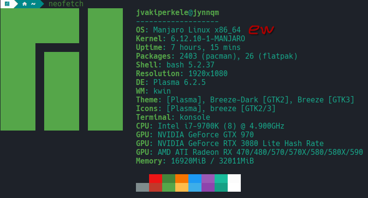
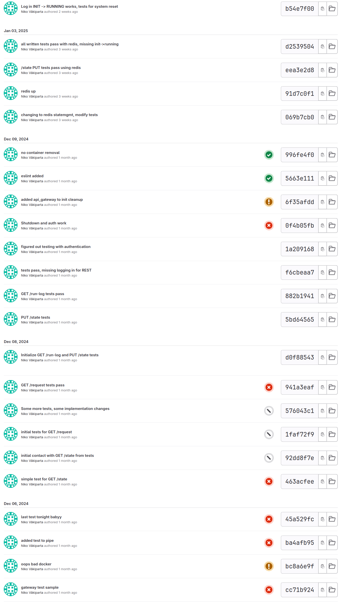
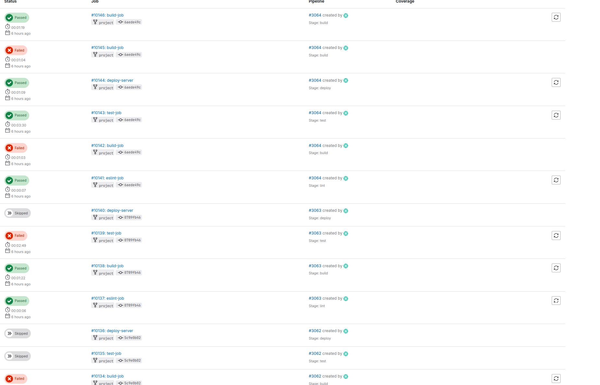

# Instructions for the teaching assistant #

### Implemented optional features ###

**List of optional features implemented.**

- Testing of individual services: **Done (test step in pipeline, somewhat extensive test suite, in /test, testing service1)**
- Static analysis step in the pipeline: **Done (eslint step in pipeline, linting service1)**
- Monitoring and logging for troubleshooting: **Done (in browser view, minimal)**
- Deployment to external server: **Done (with cPouta Ubuntu 22.04 image, IP 86.50.231.95)**

####  Instructions for examiner to test the system. ####

**Pay attention to optional features.**

- Testing the system can be done through addresses
    Example: http://86.50.231.95:8197/state
    - http://86.50.231.95:8197/*something* -> API (username: user1, password: your_mom)
        - /state PUT & GET (PUT needs auth) -> System state management
        - /request GET -> Request service data
        - /run-log GET -> Run log
    - http://86.50.231.95:8198/*something* -> Browser front (username: user1, password: your_mom)
        - /controlpanel.html -> Main page
        - /shutdown POST -> Shutdown containers
        - /api GET -> Service request
        - /debug-monitor GET -> Monitor system

Alternatively you can build the system locally (if for example the cPouta service has crashed at the time of inspection, lol):

Installation:

    1. Install docker-compose on computer
    2. git clone -b project https://github.com/Ka1aschNikoV/course-devops.git
    3. cd course-devops
    4. sudo docker-compose build --no-cache
    5. sudo docker-compose up -d

    Finally: 
        Enter in browser: 
        - http://localhost:8197 -> API
        - http://localhost:8198 -> Browser front
    Auth is done through either
        - Browser -> insert username password manually in prompt
        - API -> Send authentication header (like in curl example for PUT)

    Then the test command with curl:

      curl localhost:8197/state -X PUT -d "PAUSED" -H "Content-Type: text/plain" -H "Accept: text/plain"

    6. And finally: sudo docker-compose down

**Data about the platform you used in development (hardware, CPU architecture, operating system, version of docker and docker-compose)**

- Processor: Coffee Lake Intel Core i7 9700k, x86
- Docker: docker-1:27.3.1-1
- Docker-compose: wasn't used locally, only on deploy machine and runner (version docker-compose-1.29.2-1, see Reflections)

### Description of the CI/CD pipeline ###
**Briefly document all steps:**

• **Version management; use of branches etc**

- Branch "project" was used in both gitlab and github, and is the only branch to be inspected. Push into GitLab repo triggers gitlab-runner actions

• **Building tools**

- Locally using docker compose up --build, on deployment server docker-compose up -d. gitlab-runner was used on the host computer, containerized with gitlab-runner image,
  run on host computer with sudo docker compose up --build. Runner does 4 jobs, eslint-job, build-job, test-job, deploy-server

• **Testing; tools and test cases**

- Testing with mocha/chai. Testing is done with its own test container, and tests cover all API's and services in some form. Testing is quite general, since I did not want to spend too much time with formatting tests to fit my purposes, the most complex one is probably the gatewayGetState service1 and service2 content detection. Test driven development is more evident in initial commits with a genuine effort made, there were some excessive spam commits and accidental secret leaks when debugging the gitlab-runner + docker combo later on, below is a snippet of the earlier commit history

  

• **Packing**

- Not done, images are sent to GitLab container registry in build, and are pulled in deployment step, files are scp'd over from gitlab-runner to deployment

• **Deployment**

- Done as instructed on cPouta server, with IP 86.50.231.95

• **Operating; monitoring**

- Minimal monitoring implemented in browser, operation through browser or 8197 port API endpoints
- Pipeline is operated on separate machine with a containerized gitlab-runner, run with sudo docker compose up --build. Since config.toml is a risky share, I included it as a picture instead with token blurred (./gitlab-runner/config/image_of_config_toml.png). Pipeline uses docker executor because shell executor was more cumbersome.

### Example runs of the pipeline ###

**Include some kind of log of both failing test and passing.**

### Reflections ###

#### Main learnings and worst difficulties ####

- Going into this I thought this was a mundane task, but it ended up being very interesting and motivated me to investigate more, very good
- Hardest part was to figure out how connectivity between containers works in non-host environments. 
- A lot was learned about version control, actions, linux, containers, permissions, ssh, external servers

*I couldn't use docker-compose locally, since I wanted to use*
  *docker-desktop package for convenience, and currently on Arch docker-compose conflicts with docker-desktop. However, gitlab-runner container and deployment server use docker-compose*

**Especially, if you think that something should have been done differently, describe it here.**

- If I had even more time I would've made a *custom login service:* 
  
  The current one with nginx basic auth doesn't serve user login detection well, and sometimes causes a race
  condition between service1 load balanced containers, although this only shows itself in the run-log file occasionally, and doesn't effect other
  functionality. Also, in general the authenticaion only considers the existence of a logged in user, thus doesn't support simultaneous use, which
  isn't ideal for anything real-world. The system is also quite slow (mocha test timeout is 7000 lol) because the sharing of state with service1 containers
  and using redis state management + shared container files takes time.

#### Amount effort (hours) used ####

**Give your estimate**

- I spent about 80-90 hours total, and had fun through all of it, and learned a lot